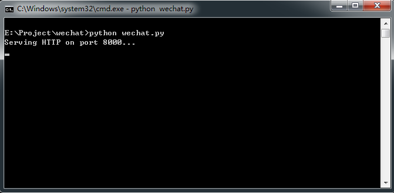
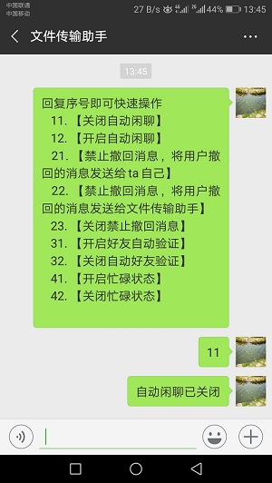

# wechatManager

wechatManager是一个基于[itchat](https://github.com/littlecodersh/ItChat/blob/master/README.md)库的**微信管理**工具。


## 运行环境
- Windows/Linux
- python2/3

## 特点
使用简单，支持windows和Liunx平台, 支持python3/2。  
使用者不需要编写代码的能力即可轻松使用，轻松管理自己的微信。  
扫码登陆后可在手机上操作wechatManager。  
wechatManager完全基于itchat库代码，可随着itchat更新。  

## 支持的功能
- [x] 收到消息自动与好友闲聊
- [x] 查看对方已经撤回但自己还来不及看的消息
- [x] 自动同意好友验证请求
- [x] 可设置忙碌状态
- [x] 自定义回复消息

## 暂不支持
- [ ] 检测好友是否将自己删除
- [ ] ...

## 试一试

访问 [wechat.aijialin.cn](http://wechat.aijialin.cn) 立即体验使用wechatManager管理你的个人微信

## 如何使用
**itchat运行需要requests, pyqrcode, pypng 库, 请先安装这些库**  
1. 在命令行中输入以下命令即可运行wechatManager, 程序默认使用8000端口。  
若需要改为其他端口，运行时将端口写在后面即可。  

```python
python wechatManager.py 8000   
```
2. 打开浏览器，在地址栏输入127.0.0.1:8000, 出现wechatManager页面后点击获取二维码  
3. 扫描二维码，根据浏览器上的提示点击确认即可登陆成功。  
4. 登陆成功后浏览器跳转到操作界面。  

## 运行截图



## 如何在手机上操作
用浏览器操作有点儿麻烦，毕竟我们不是什么时候都在电脑前的。  
wechatManager支持在手机上操作。当你在微信中打开文件传输助手时  
wechatManager会给你发送一些操作快捷指令，输入对应序号即可操作相应功能。  



## 想让朋友们也用上?
wechatManager使用python自带的wsgiref库，支持WSGI协议。  
如果你有一台服务器，你完全可以将它配置在fastcgi中。    
然后通过你配置的域名访问，例如 [wechat.aijialin.cn](http://wechat.aijialin.cn)

## 运行日志
- 程序运行后会在logs目录产生日志，方便查看。

## 关于
- 仅用来学习交流，严禁用于非法用途。

