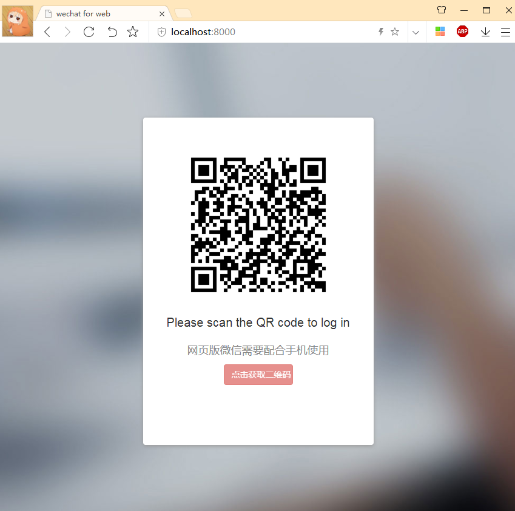
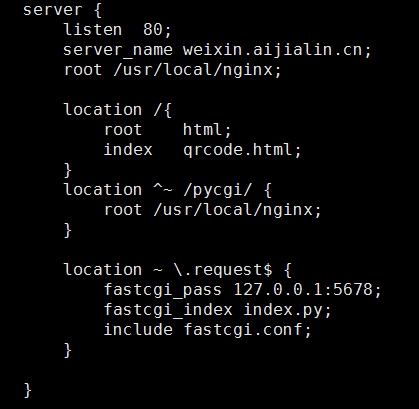
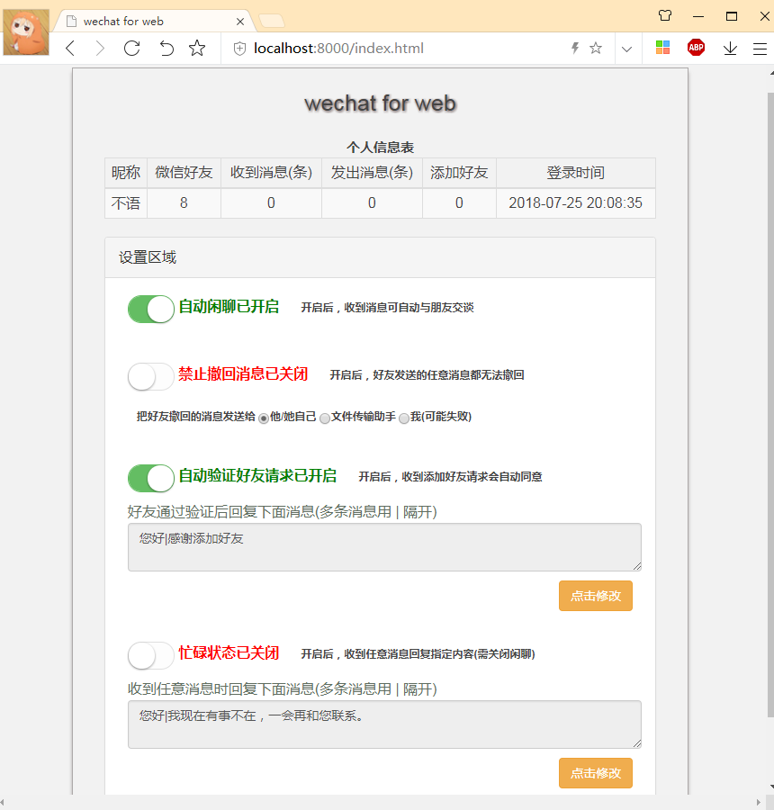

# wechatManager
![py35][py35]  
wechatManager是一个基于[itchat](https://github.com/littlecodersh/ItChat/blob/master/README.md)库的微信管理工具。  
使用简单，支持windows和Liunx平台。  
使用者不需要编写代码的能力即可轻松使用，轻松管理自己的微信。  
wechatManager未修改itchat库代码，方便随着itchat更新。  
默认使用8000端口，也可在启动时指定端口。  
例如使用8888端口:  
```python
python wechat.py 8888   
```

## 使用
itchat运行需要requests, pyqrcode, pypng 库, 请先安装这些库  


## 扫码登陆
- 启动程序后打开浏览器，如果是本地则输入localhost:8000 或者127.0.0.1:8000  
- 如果程序运行在远程服务器上，则输入服务器IP:8000  



- wechatManager使用python自带的wsgiref库，完全支持WSGI协议，你还可以将它配置在nginx中  
  
然后通过你配置的域名访问，例如 [weixin.aijialin.cn](weixin.aijialin.cn)

## 管理界面
目前支持的功能有：  

- 自动聊天 (采用图灵机器人api, 可自动与好友聊天)  
- 消息防撤回 (当检测到好友撤回消息时，可将消息发送给他或者选择发送给文件传输助手)
- 自动通过好友请求验证 (当接受到加好友请求时自动验证并通过, 你还可以设置通过验证后给好友发消息)
- 忙碌或者离开状态 (类似QQ的离开状态，设置后当收到好友消息时回复指定消息)


## 运行日志
- 程序运行后会在logs目录产生日志，方便查看。

## 关于
- 仅用来学习交流，严禁用于非法用途。

